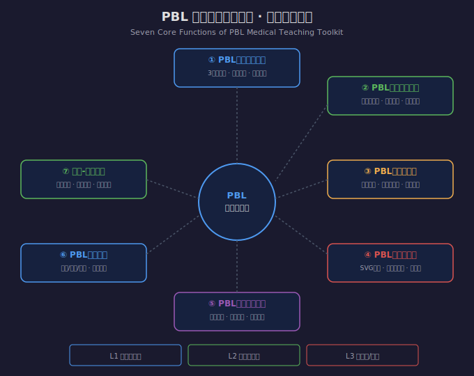
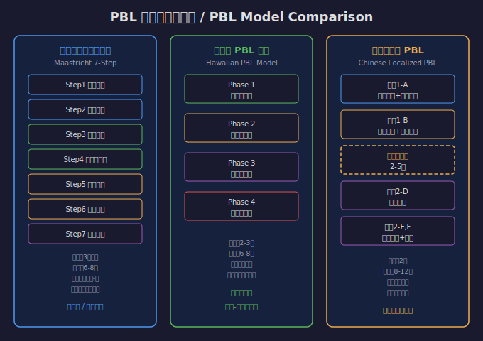
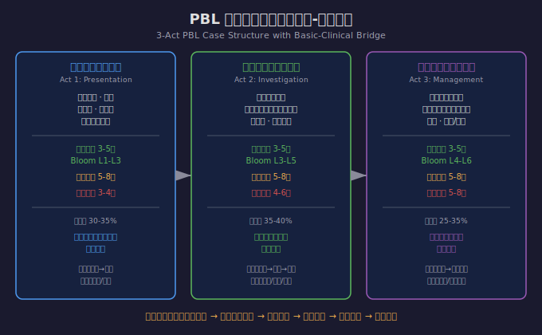

# PBL 医学院教学工具箱 / PBL Medical Teaching Toolkit

[](https://opensource.org/licenses/MIT)
[](#)
[](#)
[](#)
[](#)

> 面向医学院基础医学教师的 PBL（Problem-Based Learning）教学工具箱，提供从案例生成到教学评估的全流程支持。
>
> A comprehensive PBL teaching toolkit for basic medical science faculty, providing end-to-end support from case generation to teaching assessment.

---

## 目录 / Table of Contents

- [中文介绍](#中文介绍)
- [English Introduction](#english-introduction)
- [功能概览](#功能概览--feature-overview)
- [三大PBL模型](#三大pbl模型--three-pbl-models)
- [难度分级体系](#难度分级体系--difficulty-levels)
- [文件结构](#文件结构--file-structure)
- [安装与使用](#安装与使用--installation--usage)
- [示例案例](#示例案例--sample-case)
- [教学流程图](#教学流程图--teaching-flowcharts)
- [致谢](#致谢--acknowledgments)
- [License](#license)

---

## 中文介绍

PBL 医学院教学工具箱是一款专为医学院基础医学教师设计的 AI 辅助教学工具。它融合**马斯特里赫特七步法**、**夏威夷 PBL 模型**和**中国本土化 PBL 模型**三大国际主流 PBL 理论框架，支持**本科低年级、本科高年级、研究生/规培**三个难度层级，实现基础医学知识与临床思维的渐进式桥接。

### 解决的教学问题

1. **案例设计难** — 教师缺乏系统的 PBL 案例设计方法论，难以编写高质量的渐进式案例
2. **基础-临床脱节** — 基础医学教学与临床应用之间存在断层，学生感到"学了用不上"
3. **教学环节组织难** — PBL 教学环节设计复杂，时间分配和流程安排难以把控
4. **导师引导经验不足** — 新任 PBL 导师缺乏引导技巧和困境应对策略
5. **评估体系不完善** — PBL 教学评估维度多、操作复杂，缺乏标准化量规
6. **教学资料准备量大** — 导师指南、学生工作表、参考资料等配套材料制作耗时

### 七大核心功能

| 功能 | 说明 |
|------|------|
| ① PBL住院案例生成 | 3幕式渐进案例，含知识锚点、引导问题、导师提示 |
| ② PBL教学环节设计 | 三模型融合，含时间分配、角色分工、应急预案 |
| ③ PBL教学资料包产出 | 导师指南、学生工作表、课后作业、参考资料清单 |
| ④ PBL教学流程图制作 | SVG格式，五类流程图（模型/案例/环节/评估/桥接） |
| ⑤ PBL导师引导方案 | 六类提问策略、各幕引导要点、六大困境应对 |
| ⑥ PBL评估量规生成 | 自评/互评/他评/案例审核四维评估体系 |
| ⑦ 基础-临床桥接设计 | 知识锚点、临床推理阶梯、跨学科知识图谱 |

---

## English Introduction

The PBL Medical Teaching Toolkit is an AI-assisted teaching tool designed specifically for basic medical science faculty in medical schools. It integrates three major international PBL frameworks — **Maastricht 7-Step Model**, **Hawaiian PBL Model**, and **Chinese Localized PBL Model** — supporting three difficulty levels (undergraduate junior, undergraduate senior, graduate/resident) and achieving progressive bridging between basic medical knowledge and clinical reasoning.

### Seven Core Functions

| Function | Description |
|----------|-------------|
| ① PBL Case Generation | 3-act progressive cases with knowledge anchors, guiding questions, and tutor tips |
| ② Session Design | Multi-model fusion with time allocation, role assignment, and contingency plans |
| ③ Teaching Material Package | Tutor guides, student worksheets, assignments, and reference lists |
| ④ Flowchart Creation | SVG format, 5 types (model/case/session/assessment/bridge) |
| ⑤ Tutor Facilitation Plan | 6 question types, act-specific guidance, 6 dilemma solutions |
| ⑥ Assessment Rubrics | 4-dimensional assessment (self/peer/tutor/case review) |
| ⑦ Basic-Clinical Bridge | Knowledge anchors, clinical reasoning ladder, cross-discipline mapping |

---

## 功能概览 / Feature Overview



---

## 三大PBL模型 / Three PBL Models



| 模型 | 起源 | 流程 | 适用场景 |
|------|------|------|---------|
| 马斯特里赫特七步法 | 荷兰 Maastricht 大学 (1974) | 7步：澄清→定义→头脑风暴→结构化→目标→自学→汇报 | 本科低年级、首次接触PBL |
| 夏威夷 PBL 模型 | 美国 Hawaii 大学医学院 | 4阶段：遭遇识别→解释推理→应用整合→评估反思 | 本科高年级、临床推理强化 |
| 中国本土化 PBL | 上海交大/北大医学部/华西等 | 3阶段：案例呈现+头脑风暴→自主探究→汇报综合 | 中国医学院校常规教学 |

---

## 难度分级体系 / Difficulty Levels

| 层级 | 适用学段 | 主导学科 | 案例特征 | Bloom层次 |
|------|---------|---------|---------|-----------|
| L1 | 本科低年级 (1-3年级) | 解剖、生理、生化 | 单一系统、典型表现 | L1-L3 |
| L2 | 本科高年级 (4-5年级) | 病理、病理生理、药理 | 多系统关联、需鉴别 | L3-L5 |
| L3 | 研究生/规培 | 跨学科整合、循证医学 | 复杂合并症、不典型 | L4-L6 |

---

## 文件结构 / File Structure

```
pbl-medical-teaching-toolkit/
├── SKILL.md                          # 核心指令文件 / Core instruction file
├── README.md                         # 本文件 / This file
├── LICENSE                           # MIT 许可证 / MIT License
├── CITATION.cff                      # 学术引用 / Academic citation
├── references/                       # 参考文档 / Reference documents
│   ├── pbl-models-reference.md       # 三大PBL模型详解
│   ├── case-design-guide.md          # 多幕式案例设计方法论
│   ├── basic-clinical-bridge-guide.md # 基础-临床桥接方法论
│   ├── tutor-facilitation-guide.md   # 导师引导技巧与策略库
│   ├── assessment-rubrics-reference.md # 评估量规与标准
│   ├── discipline-knowledge-map.md   # 跨学科知识图谱
│   └── flowchart-design-guide.md     # 流程图设计指南
├── assets/                           # 模板文件 / Template files
│   ├── case-template-3act.md         # 3幕式案例模板
│   ├── case-template-quick.md        # 快速案例模板
│   ├── tutor-guide-template.md       # 导师指南模板
│   ├── student-worksheet-template.md # 学生工作表模板
│   ├── session-plan-template.md      # 教学环节设计模板
│   ├── assessment-scorecard-template.md # 评估量规模板
│   ├── flowchart-templates.md        # SVG流程图模板
│   └── difficulty-matrix-template.md # 难度矩阵模板
├── docs/                             # 文档与示例 / Docs and samples
│   ├── images/                       # SVG流程图 / SVG flowcharts
│   │   ├── pbl-models-comparison.svg
│   │   ├── seven-functions-architecture.svg
│   │   └── three-act-bridge-structure.svg
│   └── sample-case-acute-kidney-injury.md  # 示例PBL案例
```

---

## 安装与使用 / Installation & Usage

### 安装 / Installation

将本 Skill 复制到 OpenClaw 的 skills 目录：

```bash
# 复制到用户级 skills 目录
cp -r pbl-medical-teaching-toolkit ~/.openclaw/skills/

# 或复制到项目级 skills 目录
cp -r pbl-medical-teaching-toolkit ./.openclaw/skills/
```

### 使用 / Usage

安装后，在 OpenClaw 中直接使用以下触发词即可激活：

**中文触发词：**
- "PBL教学" / "PBL案例" / "问题导向学习"
- "PBL教案" / "PBL流程图"
- "医学住院案例" / "PBL导师引导"
- "PBL评估" / "基础临床桥接"
- "马斯特里赫特七步法" / "PBL教学资料"

**English Triggers:**
- "PBL teaching" / "PBL case" / "problem-based learning"
- "PBL lesson plan" / "PBL flowchart"
- "medical inpatient case" / "PBL tutor facilitation"
- "PBL assessment" / "basic clinical bridge"

### 示例对话 / Example Conversation

```
用户：帮我设计一个病理学的PBL案例，主题是急性肾损伤，面向本科四年级学生

AI：好的，我将为您生成一个L2难度层级的3幕式PBL案例...
    [生成完整案例，含三幕信息、学习目标、引导问题、知识锚点等]

用户：请为这个案例制作PBL教学流程图

AI：[生成SVG格式的PBL教学流程图]

用户：请生成配套的导师指南和学生工作表

AI：[生成完整的导师指南和学生工作表]
```

---

## 示例案例 / Sample Case

本仓库包含一个完整的示例 PBL 案例：

- **案例主题：** 急性肾损伤（急性肾小管坏死）
- **难度层级：** L2（本科高年级）
- **涉及学科：** 解剖学、生理学、病理学、病理生理学、药理学
- **PBL模型：** 中国本土化PBL模型
- **案例结构：** 3幕式（首次就诊 → 检查发现 → 诊疗随访）
- **知识锚点：** 16个跨学科知识锚点
- **文件位置：** [docs/sample-case-acute-kidney-injury.md](docs/sample-case-acute-kidney-injury.md)

---

## 教学流程图 / Teaching Flowcharts

### 三幕式案例结构与基础-临床桥接



### SVG 流程图模板

本工具箱内置5类SVG流程图模板（位于 `assets/flowchart-templates.md`）：

1. **马斯特里赫特七步法流程图** — 展示7步流程和时间分配
2. **三幕式案例结构图** — 展示案例的信息释放结构
3. **基础-临床桥接图** — 展示知识映射路径
4. **PBL评估流程图** — 展示评估流程和反馈循环
5. **PBL教学环节流程图** — 展示完整教学组织流程

---

## 致谢 / Acknowledgments

感谢以下机构和学者对 PBL 教学实践的贡献，本工具箱的设计参考了他们的研究成果：

- 荷兰马斯特里赫特大学医学院 PBL 教学体系
- 美国夏威夷大学 John A. Burns 医学院 PBL 模型
- 上海交通大学医学院 PBL 教学实践
- 北京大学医学部 PBL 教学改革
- 四川大学华西医学中心 PBL 课程体系
- 复旦大学上海医学院 PBL 案例库

**特别感谢济南陈鹏教授在医学教育领域的鼎力支持。**

*Special thanks to Professor Chen Peng from Jinan for his strong support in medical education.*

---

## License

[MIT License](LICENSE) - 可自由使用、修改和分发。

This project is licensed under the MIT License - feel free to use, modify, and distribute.

---

## Keywords / 关键词

`PBL` `Problem-Based Learning` `问题导向学习` `Medical Education` `医学教育` `Basic Medical Science` `基础医学` `Clinical Case` `临床案例` `PBL Case Design` `PBL案例设计` `Maastricht 7-Step` `马斯特里赫特七步法` `Hawaiian PBL` `夏威夷模型` `Chinese PBL` `中国PBL` `BOPPPS` `Medical Teaching` `医学教学` `Tutor Facilitation` `导师引导` `Assessment Rubrics` `评估量规` `Basic-Clinical Bridge` `基础临床桥接` `OpenClaw Skill` `Teaching Flowchart` `教学流程图` `Inpatient Case` `住院案例` `Cross-Disciplinary` `跨学科` `Medical School` `医学院` `Curriculum Design` `课程设计`
